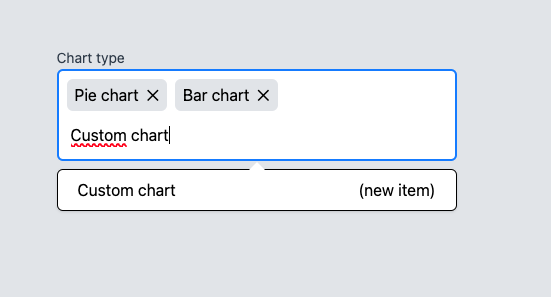

# multiselect

A multi-select component for Vue.js.

## Preview



## URL to Storybook

https://storybook-multiselect.vercel.app/?path=/docs/multiselect--docs

## URL to domain

https://multiselect-lime.vercel.app/

## Recommended IDE Setup

[VSCode](https://code.visualstudio.com/) + [Volar](https://marketplace.visualstudio.com/items?itemName=Vue.volar) (and disable Vetur).

## Project Setup

```sh
pnpm install
```

### Compile and Hot-Reload for Development

```sh
pnpm dev
```

### Run Storybook locally

```sh
pnpm storybook
```

Note: Storybook is running on http://localhost:6006

### Type-Check, Compile and Minify for Production

```sh
pnpm build
```

### Run Unit Tests with [Vitest](https://vitest.dev/)

```sh
pnpm test:unit
```

### Lint with [ESLint](https://eslint.org/)

```sh
pnpm lint
```
